# LLMs inference benchmarks, using vLLM, on Lambda Cloud

We conduct LLM inference benchmarks on various NVIDIA GPUs (A100 and H100). Our benchmarks used vLLM to evaluate Llama and Mistral models ranging from 7B to 405B in size. The key insights are:
* Results highlight trade-offs between throughput and latency, with increased GPU parallelism improving overall performance but varying depending on model size and configuration.
* The NVIDIA H100 shows significant performance improvements over the A100, delivering roughly 2x higher throughput and lower latency across different models and GPU configurations.

## Variables

Here is the summary of all variables in our benchmarks:

__Models__: We benchmark models from the Llama and Mistral families. The model sizes range between 7B to 405B. The full list of models can be found in [this script](https://github.com/LambdaLabsML/vllm-benchmark/blob/main/cache_model.py#L3). 

__GPUs__: We have benchmarked NVIDIA H100-80GB-SXM and NVIDIA A100-80GB-SXM GPUs, in `1x`, `2x`, `4x` and `8x` settings. The reason for not going beyond a single node is the biggest model (`Llama3.1 405B`) can be served by 8x GPUs, hence one can keep tensor parallelism within a single server and scale out the performance more effeciently using data parallelism. 

__Benchmark settings__: The [default vLLM settings](https://docs.vllm.ai/en/latest/models/engine_args.html) are generally very good. However we did experimented different values for the following parameters:
* `--max-model-len`: Defines the model context length, which impacts the memory required for KV cache. We test different values to identify the max context length a specific hardware configuration can support a specific model with.
* `--tensor-parallel-size`: Defines how to splits a model across multiple GPUs, so to serve models that are too large to fit on a single GPU.
* `--num-prompts`: Beside vLLM settings, The [benchmark script](https://github.com/vllm-project/vllm/blob/main/benchmarks/benchmark_serving.py) provides this argument to control the number of requests. Notice vLLM will [automatically batch](https://github.com/vllm-project/vllm/issues/1707#issuecomment-1816797973) these requests in a optimzed way, as long as they are [sent asynchronously](https://github.com/vllm-project/vllm/issues/2257#issuecomment-1869400614) (as implemented in the [benchmark script](https://github.com/vllm-project/vllm/blob/main/benchmarks/benchmark_serving.py)).

__Metrics__: Our benchmarks monitor `Output token throughput` and `Inter-token Latency`. Both of them are important performance metrices for LLM inference. As we will show later, there is also a trade-off between them: one can increase the overall throughput by increasing the batch size, at the cost of increasing the latency. We captured such a trade off by conducting benchmarks with different values for the aforementioned `--num-prompts` parameter.

## Results

### Max Context Length

The max context length that can be served for a specific model depends on GPU's VRAM size, and number of GPUs that are used for tensor parallelization. For example, a single NVIDIA A100/H100 80GB can serve `Meta-Llama-3.1-70B-Instruct-FP8` with upto 4k context window, wheres 2x NVIDIA A100/H100 80GB can serve the same model upto 128k context length. For the largest Llama Model (405B), one need 8x NVIDIA A100/H100 80GB to serve at its full 128k context length.

| GPU                | Meta-Llama-3.1-8B-FP8 | Meta-Llama-3.1-70B-Instruct-FP8 | Hermes-3-Llama-3.1-405B-FP8 | Mistral-7B-Instruct-v0.3 | Mixtral-8x7B-Instruct-v0.1 | Mixtral-8x22B-Instruct-v0.1 | Mistral-Nemo-Instruct-2407 | Mistral-Large-Instruct-2407 |
|--------------------|-----------------------|---------------------------------|-----------------------------|---------------------------|----------------------------|-----------------------------|----------------------------|-----------------------------|
| 1xA100-80GB-SXM    | 128k                | 4k                            | 0                           | 32k                     | 0                          | 0                           | 128k                    | 0                           |
| 2xA100-80GB-SXM    | 128k                | 128k                          | 0                           | 32k                     | 32k                      | 0                           | 128k                    | 0                           |
| 4xA100-80GB-SXM    | 128k                | 128k                          | 0                           | 32k                     | 32k                      | 16k                       | 128k                    | 128k                     |
| 8xA100-80GB-SXM    | 128k                | 128k                          | 128k                      | 32k                     | 32k                      | 64k                       | 128k                    | 128k                     |
| 1xH100-80GB-SXM    | 128k                | 4k                            | 0                           | 32k                     | 0                          | 0                           | 128k                    | 0                           |
| 2xH100-80GB-SXM    | 128k                | 128k                          | 0                           | 32k                     | 32k                      | 0                           | 128k                    | 0                           |
| 4xH100-80GB-SXM    | 128k                | 128k                          | 0                           | 32k                     | 32k                      | 16k                       | 128k                    | 128k                     |
| 8xH100-80GB-SXM    | 128k                | 128k                          | 128k                      | 32k                     | 32k                      | 64k                       | 128k                    | 128k                     |

### Throughput v.s. Latency curve
One very useful way to understand the performance is through the lens of the "throughput v.s. latency" graph, produced by changing the batch size used for inference. As mentioned earlier, there is usually a trade off between these two metrics: as the batch size increases, inference changes from being memory bandwidth bottlenecked (low latency, low throughput) to being compute bottlenecked (high latency, high throughput). The graph will eventually platuea when all NVIDIA tensor cores are staturated -- adding more data to a batch won't improve the throughput anymore.

Each of the following graphs shows the "throughput v.s. latency" profile for a specific model across different GPUs. The stronger performance profiles are closer to the top left corner (lower latency, higher throughput). Despite both NVIDIA A100 and H100 have the same amount of GPU ram (`80GB`), it is clear that the faster GPU (NVIDIA H100) and more GPUs (enables tensor parallelization) give stronger performance. 

  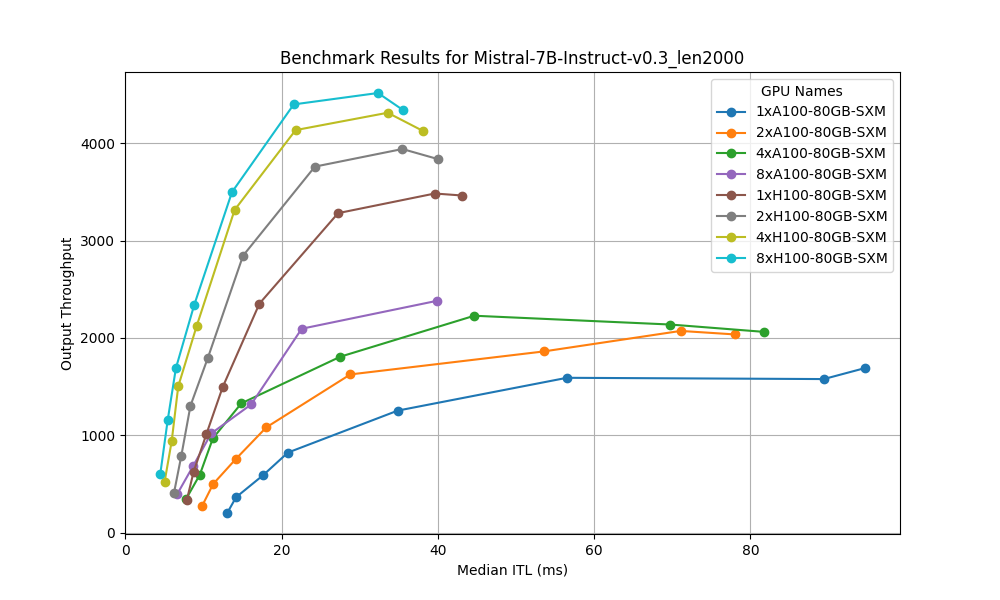
  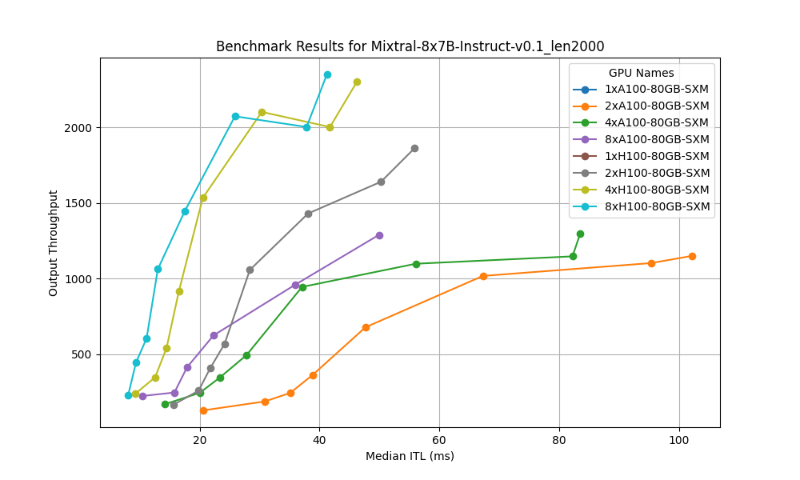
  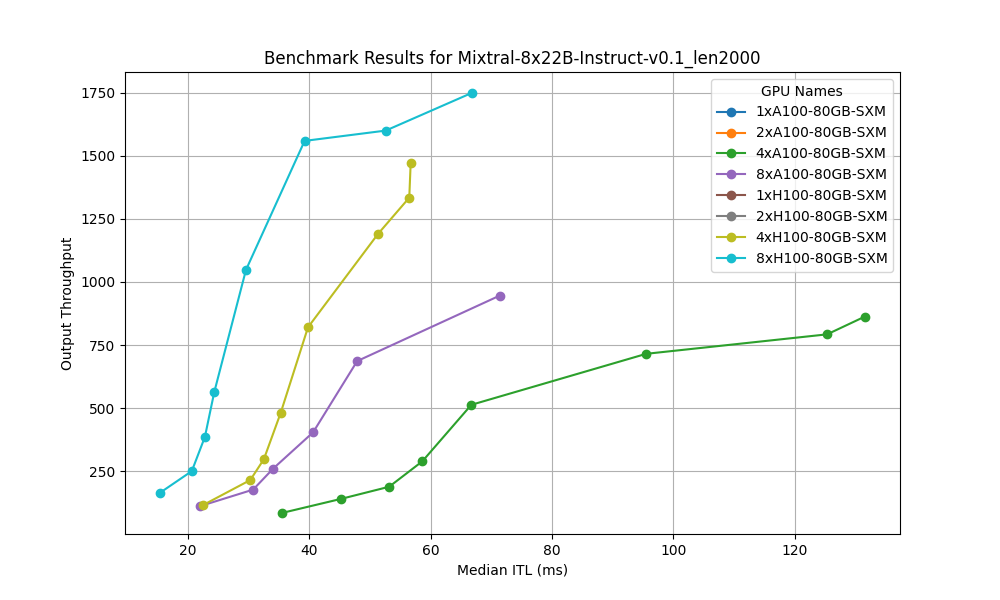

Similarly, we can plot the "throughput v.s. latency" profile for the same GPU but across different models. It is no surprise that given the same GPU, the profile of smaller models are closer to the top left. And in general serving larger models require more GPUs, as some of the models are missing from the 1x and 2x figures.

  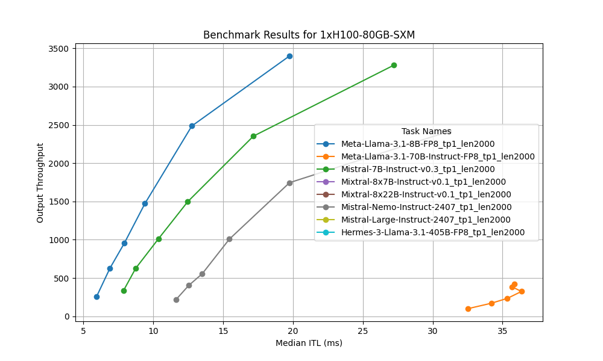
  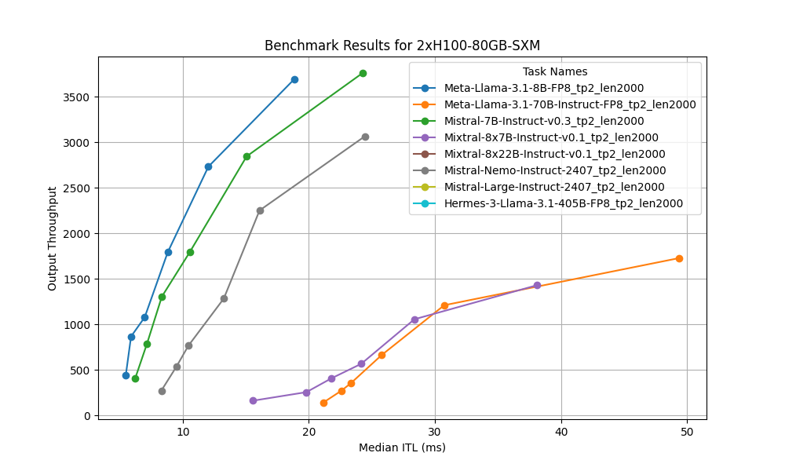
  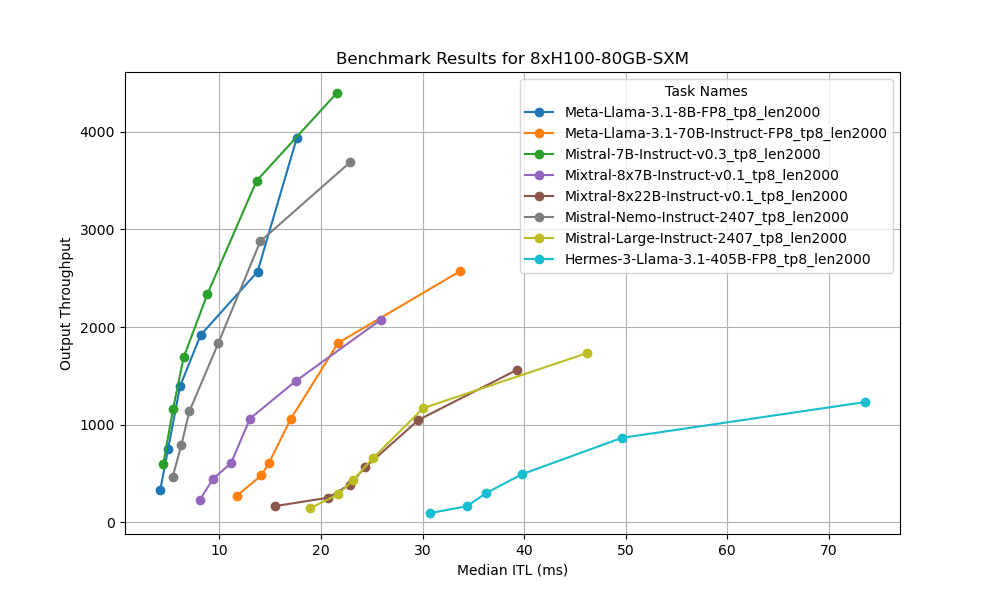

### Tensor Parallel v.s. Data Parallel
Which is a better way to scale the performance? Is it better to scale vertically using tensor parallelism, or is it better to scale horizontally with daa parallelism. The former gives you a "beefier" processor by combining the memory and tensor cores from multiple GPUs, at the cost of inter-device communication; while the later keep each GPUs independent so you have a fleet of less powerful devices. 

The following figures illustrate the different characteristics of these two parallelism strategies. To do so, we doubled the number of GPUs and applied either DP to horizontally scale the system, or TF to vertically scale the system. We also double the number of prompts used in the system so to make sure data parallelism could double its throughput while keeping the latency unaffected. Our benchmark showed tensor parallelism runs at lower latencies, while data parallelism runs at higher throughputs. 

  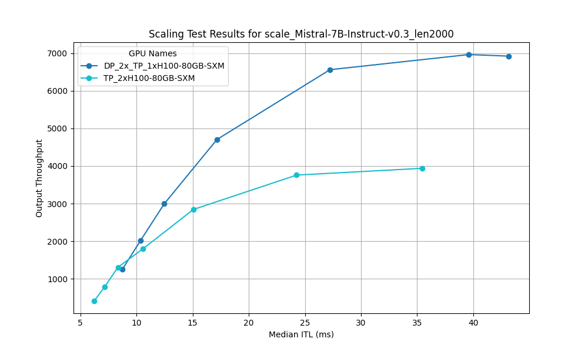
  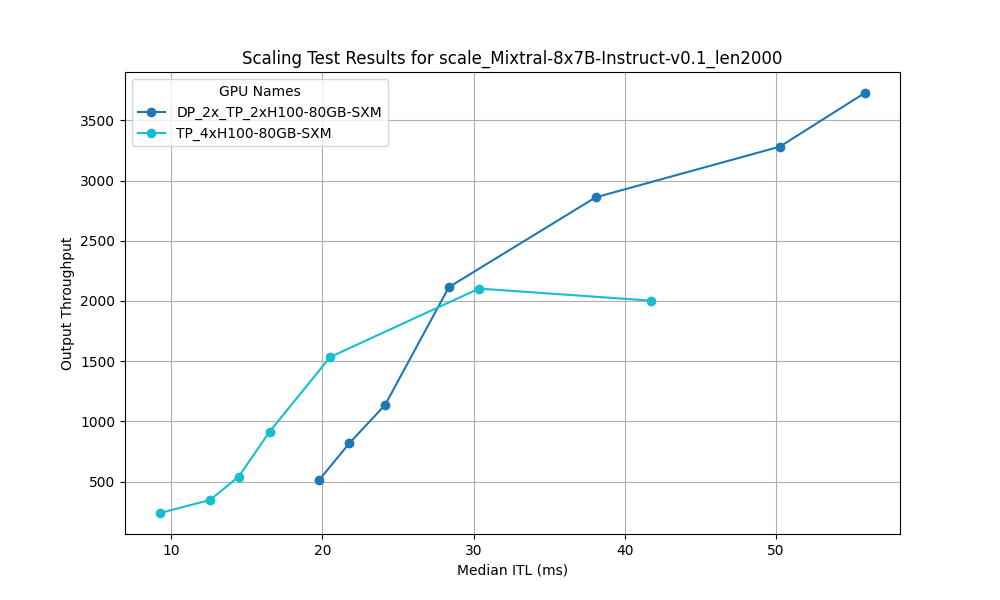
  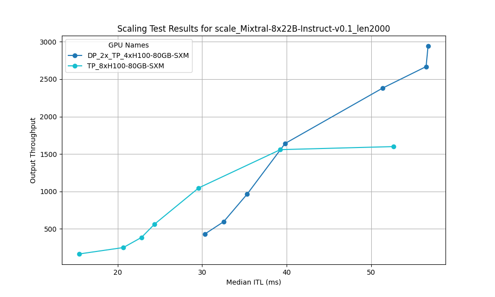

In general, scaling out the performance using data parallelism can be more rewarding, if a model can be fit into an existing system. The following table shows the `throughput/latency` across different `GPU/model` combinations, with `--num-prompts` set to 320. The reason for not increasing `--num-prompts` any further is due to the system has already saturated its compute, and no more throughput or latency improvement can be achived with larger batch size.

|                  | Meta-Llama-3.1-8B-FP8 | Meta-Llama-3.1-70B-Instruct-FP8 | Hermes-3-Llama-3.1-405B-FP8 | Mistral-7B-Instruct-v0.3 | Mixtral-8x7B-Instruct-v0.1 | Mixtral-8x22B-Instruct-v0.1 | Mistral-Nemo-Instruct-2407 | Mistral-Large-Instruct-2407 |
|------------------|----------------------:|--------------------------------:|----------------------------:|-------------------------:|---------------------------:|----------------------------:|----------------------------:|-----------------------------:|
| 1xA100-80GB-SXM  | 1517.54/42.85          | 208.79/58.26                    | N/A                         | 1591.4/56.51             | N/A                        | N/A                         | 1277.85/61.48               | N/A                          |
| 2xA100-80GB-SXM  | 1854.27/38.21          | 662.64/120.32                   | N/A                         | 1861.61/53.52            | 1017.34/67.24              | N/A                         | 1593.97/51.39               | N/A                          |
| 4xA100-80GB-SXM  | 1899.76/40.02          | 956.53/88.25                    | N/A                         | 2228.35/44.66            | 1098.11/56.05              | 715.37/95.54                | 1919.13/44.7                | 642.03/129.96                |
| 8xA100-80GB-SXM  | 1972.26/40.47          | 1162.78/74.12                   | 467.85/180.74               | 2381.43/39.89            | 1289.26/49.91              | 946.22/71.43                | 2035.34/40.7                | 947.56/88.72                 |
| 1xH100-80GB-SXM  | 3400.4/19.75           | 418.92/35.84                    | N/A                         | 3281.19/27.23            | N/A                        | N/A                         | 2414.81/31.16               | N/A                          |
| 2xH100-80GB-SXM  | 3688.64/18.83          | 1727.69/49.33                   | N/A                         | 3758.54/24.26            | 1430.42/38.08              | N/A                         | 3064.06/24.44               | N/A                          |
| 4xH100-80GB-SXM  | 3475.27/20.26          | 2242.99/38.26                   | N/A                         | 4133.32/21.79            | 2102.86/30.36              | 1190.38/51.35               | 3509.24/22.1                | 1301.24/56.42                |
| 8xH100-80GB-SXM  | 3931.83/17.61          | 2572.8/33.71                    | 1230.74/73.54               | 4397.11/21.56            | 2073.9/25.88               | 1558.66/39.25               | 3686.29/22.85               | 1734.19/46.23                |

### Performance v.s. max_model_len
Although the `max_model_len` decides the max context length a system can support a model with, it is interesting that the "throughput v.s. latency" profile doesn't vary by it. As shown in the figure below, there is little difference between the benchmark outcomes of the same system using `max_model_len` range between `2000`  to `128000`. 

  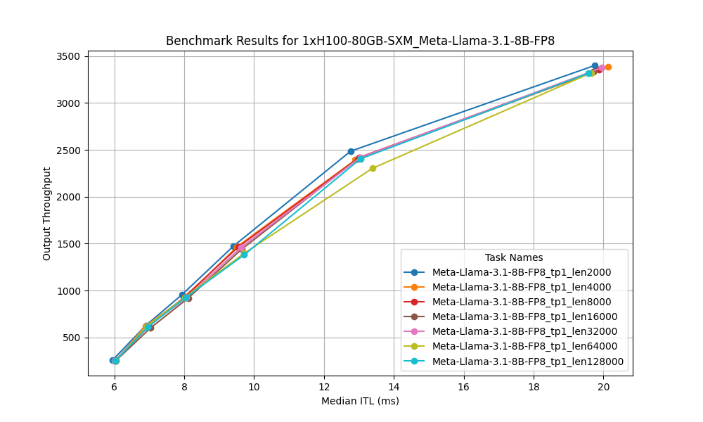
  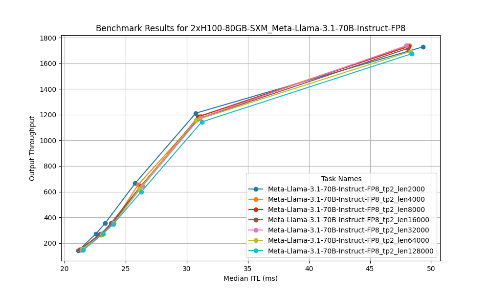
  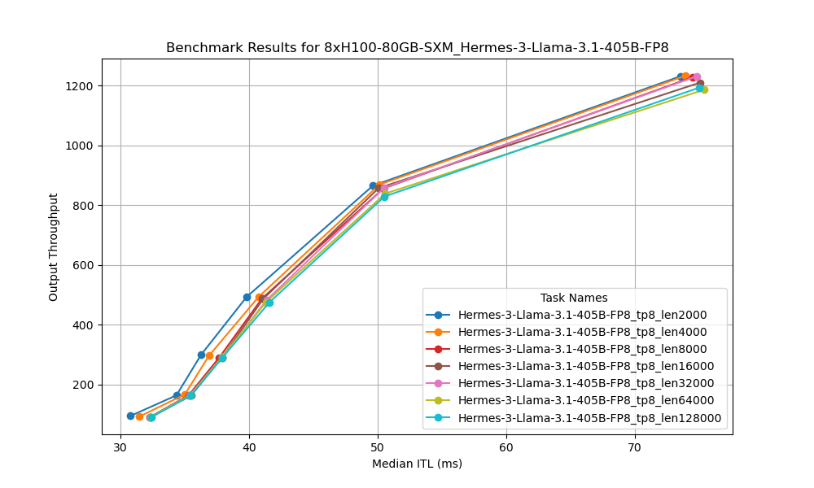

### H100 v.s. A100
The performance gap between NVIDIA H100 80GB SXM and A100 80GB SXM varies from model to model. Overall H100 can deliver around 2x higher throughput and 2x lower latency. As an example, for serving `Mistral-7B-Instruct-v0.3`, `1xH100` delivers 2.06x higher througput and 2.07x lower latency. For serving `Hermes-3-Llama-3.1-405B-FP8`, `8xH100` delivers 2.65x higher throughput and 2.45x lower latency. 

## Conclusion
The benchmarks demonstrate that NVIDIA H100 GPUs significantly outperform A100 GPUs, especially when handling larger models like the Llama and Mistral families. By leveraging tensor parallelism and optimizing batch sizes, the vLLM framework effectively balances throughput and latency, making it a powerful tool for large-scale LLM inference. For those aiming to optimize performance in similar contexts, utilizing H100 GPUs and adjusting parallelism settings may be particularly effective.
